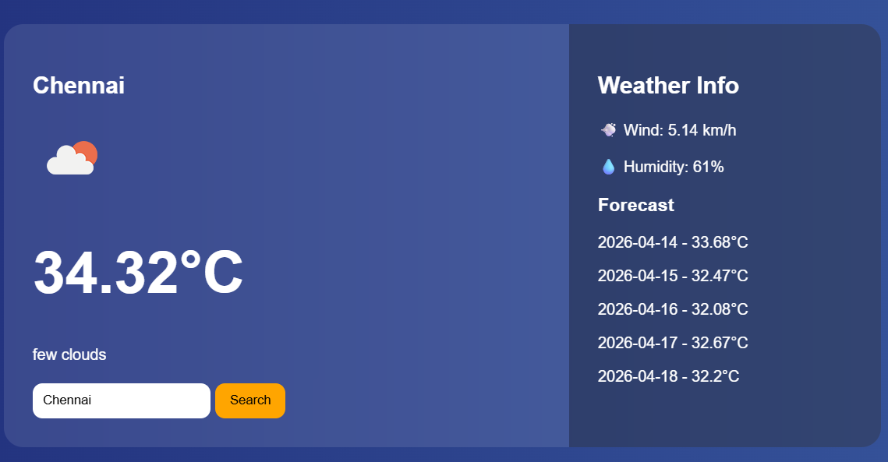

# 🌦️ Weather Pro Dashboard

A modern and responsive weather web application that provides real-time weather updates using OpenWeatherMap API.

---

## 🚀 Features

- 🌍 Auto-detect user location
- 🔍 Search weather by any city
- 🌡️ Real-time temperature display
- 🌤️ Weather condition icons
- 💨 Wind speed & humidity info
- 📅 5-day weather forecast
- 🎨 Modern glass UI design

---

## 🛠️ Technologies Used

- HTML5
- CSS3 (Glassmorphism UI)
- JavaScript (ES6)
- OpenWeatherMap API

---

## 📁 Project Structure

```
weather-pro/
│── index.html
│── style.css
│── script.js
│── README.md
```

---

## ⚙️ Setup Instructions

1. Clone the repository
2. Open the project folder
3. Add your OpenWeatherMap API key in `script.js`

```javascript
const apiKey = "dadbee070fba8c55cd3159bfbc142877";
```


## 🌐 API Used

OpenWeatherMap API
https://openweathermap.org/api

---

## 📸 Preview



---
## 🌐 Live Demo
   https://code-with-dinesh.github.io/day-9-weather-pro-dashboard/
 
